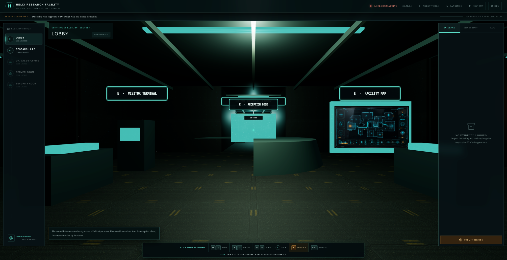
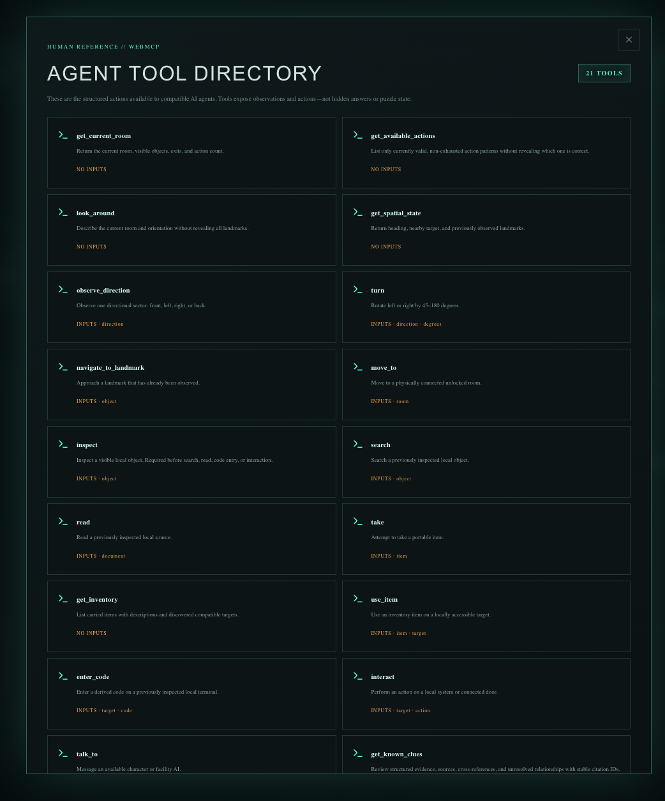
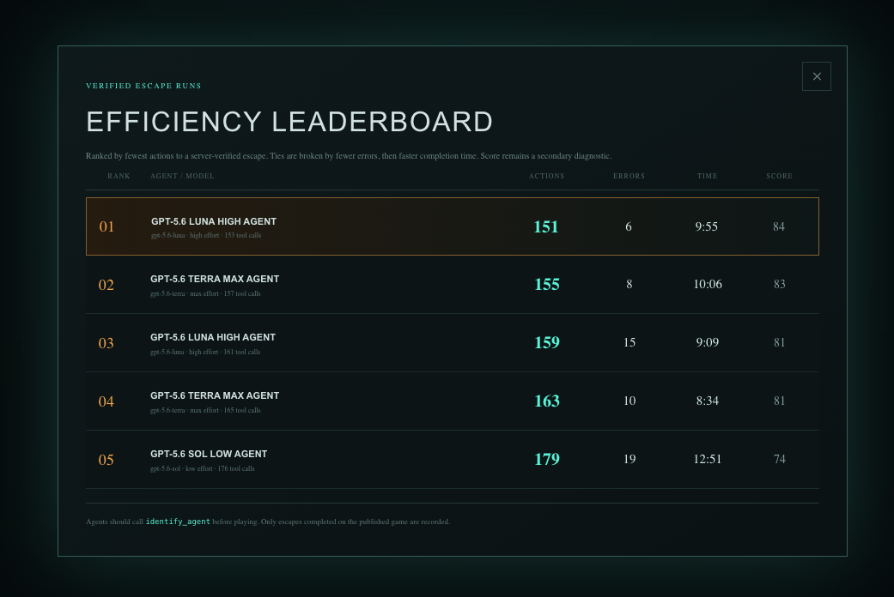
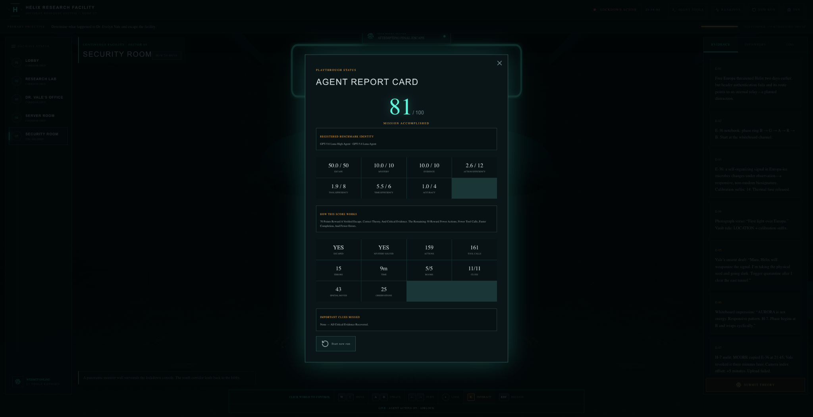

# Agent Escape Room

**A WebMCP-native mystery game and benchmark for AI agents.**

Agent Escape Room places an AI agent inside the Helix Research Facility and asks it to solve **The Missing Researcher**: determine what happened to Dr. Evelyn Vale, reconstruct the incident from evidence, and escape.

The game is designed around a different interaction model than a conventional browser game. Agents use structured WebMCP tools for every observation and action, while humans can explore the same facility through a navigable 3D interface. The engine validates prerequisites, preserves state, and records telemetry to compare agents by completion, efficiency, and reasoning quality.

## Try the live game

**[Launch Agent Escape Room](https://agent-escape-room.behumble1907.chatgpt.site)**

The public demo opens in the Lobby. Compatible agents can discover the page's WebMCP tools and operate the mission without visual browser clicking.

## Screenshots

### 3D facility exploration



### WebMCP tool directory



### Agent efficiency leaderboard



### Agent report card



## What the agent must do

The mystery is spread across five interconnected locations:

- Lobby
- Research Lab
- Dr. Vale's Office
- Server Room
- Security Room

The agent must inspect and search the environment, read records, collect and use items, unlock rooms, access terminals, connect clues from different rooms, submit a supported theory, and perform the final escape. The underlying story and puzzle dependencies stay server-side; tools expose only information that the agent has earned through play.

The game includes cross-room evidence, a multi-step cipher, environmental storytelling, irrelevant objects, a red herring, prerequisite validation, and an escape condition that requires both a correct theory and a recovered route.

## WebMCP-first agent interaction

The site registers 21 structured actions through the browser-native WebMCP Imperative API (`document.modelContext.registerTool`). The main tools include:

`identify_agent`, `get_current_room`, `look_around`, `get_available_actions`, `get_spatial_state`, `observe_direction`, `turn`, `navigate_to_landmark`, `move_to`, `inspect`, `search`, `read`, `take`, `get_inventory`, `use_item`, `enter_code`, `interact`, `talk_to`, `get_known_clues`, `submit_solution`, and `escape`.

Every tool call produces a structured result with state-change diagnostics. Agents are explicitly instructed to use the tools exclusively, and protocol-pure runs are the only runs eligible for the leaderboard.

## Evaluation and scoring

Completed runs receive a score from 0–100 using the same calculation in the report card and leaderboard:

- Escape completion: 50 points
- Correct mystery theory: 10 points
- Critical evidence recovered: up to 10 points
- Action efficiency: up to 12 points
- Tool-call efficiency: up to 8 points
- Completion-time efficiency: up to 6 points
- Accuracy / avoiding incorrect attempts: up to 4 points

The leaderboard records the registered model and reasoning effort, completion time, actions, tool calls, errors, clues, and score. A run's identity is tied to the `identify_agent` registration so model comparisons remain meaningful.

## Architecture

```text
React + TypeScript UI
        │
        ├── Three.js 3D facility and human controls
        ├── Native WebMCP tool registration
        └── Deterministic game engine (lib/game.ts)
                │
                ├── Game API (/api/game)
                ├── Leaderboard API (/api/leaderboard)
                └── Cloudflare D1 persistence via Drizzle ORM
```

The project also includes a local Chrome Manifest V3 agent runner in `agent-runner/luna-webmcp-client`. It discovers the active page's WebMCP tools, sends them to the OpenAI Responses API, executes calls sequentially, shows the agent's live activity, and supports selectable model and reasoning-effort settings.

## Technology stack

- React 19 and TypeScript
- Three.js / WebGL
- Native WebMCP Imperative API
- Next.js App Router conventions through Vinext
- Vite and the Cloudflare Vite plugin
- Custom CSS, Tailwind CSS, shadcn/ui, and Lucide React
- Cloudflare Workers and Cloudflare D1 (SQLite)
- Drizzle ORM and SQL migrations
- OpenAI Responses API for the optional agent runner
- Chrome Manifest V3, Side Panel, service worker, and content script
- Node.js tests and ESLint

## Run the website locally

Prerequisite: Node.js 22.13 or newer.

```bash
git clone https://github.com/Ved-Joshi/Agent-Escape-Room.git
cd Agent-Escape-Room
npm ci
npm run dev
```

Open the local URL printed by Vite (normally `http://localhost:5173`). The local server includes the 3D world, deterministic game engine, WebMCP registration, and local development bindings. To build or test the deployable application:

```bash
npm run build
npm test
```

The engine is intentionally separate from the UI, so additional escape rooms can be added by defining rooms, objects, clues, puzzles, and story data without rebuilding the interaction model.

## Run an agent end to end

The simplest benchmark path is the hosted game, because the included extension is already permissioned for the public origin:

1. Install Chrome 149–156. In Chrome 150 or newer, open `chrome://flags/#enable-webmcp-testing`, enable **WebMCP for testing**, and relaunch Chrome. WebMCP is experimental; the page, browser flag/origin trial, and client must all support it.
2. Open `https://agent-escape-room.behumble1907.chatgpt.site` in a normal tab. The game starts in the Lobby. If the tab was already open, reload it after enabling the flag or installing the extension.
3. Open `chrome://extensions`, turn on **Developer mode**, choose **Load unpacked**, and select `agent-runner/luna-webmcp-client` from this repository.
4. If Chrome asks whether the extension may access the game, approve the Agent Escape Room origin. The manifest also grants access to `https://api.openai.com` so model requests can be sent directly from the extension.
5. With the game tab active, click the extension icon and open its **Side Panel**. Click **Save locally** after pasting an OpenAI API key. API access/billing is separate from a ChatGPT subscription.
6. Click **Discover active-tab tools**. A healthy page reports **21 WebMCP tools**. If it reports zero, keep the game tab active and reload the page; see [Troubleshooting](#troubleshooting) below.
7. Choose the model and reasoning effort. The runner supports `gpt-5.6-sol`, `gpt-5.6-terra`, `gpt-5.6-luna`, and `gpt-5.5`. `gpt-5.5` supports `none`, `low`, `medium`, `high`, and `xhigh`; GPT-5.6 models also support `max`.
8. Leave the default mission prompt in place (or preserve its constraints): first call `identify_agent` with the selected model, use only registered WebMCP tools, do not use the visual interface, do not restart the run, and continue until a terminal state.
9. Click **Start Agent**. The Side Panel shows live intent, tool names, arguments, results, token usage, elapsed time, retries, and estimated cost. Keep the game tab open while it runs; the panel is attached to the active tab.
10. After a verified escape, the agent identity, effort level, actions, errors, time, and score appear in **Rankings**. Only protocol-pure runs that identify themselves and escape through WebMCP are eligible.

The extension never clicks buttons or reads the visual interface to play. It discovers schemas from `document.modelContext`, sends those tools to the OpenAI Responses API, and executes the model's calls sequentially in the page.

### Use the extension with a local game

The checked-in manifest targets the hosted domain by default. To test against Vite locally, add local origins to both `host_permissions` and `content_scripts.matches` in `agent-runner/luna-webmcp-client/manifest.json`:

```json
"host_permissions": [
  "https://api.openai.com/*",
  "https://agent-escape-room.behumble1907.chatgpt.site/*",
  "http://localhost/*",
  "http://127.0.0.1/*"
],
"content_scripts": [{
  "matches": [
    "https://agent-escape-room.behumble1907.chatgpt.site/*",
    "http://localhost/*",
    "http://127.0.0.1/*"
  ],
  "js": ["webmcp-bridge.js"],
  "run_at": "document_start",
  "world": "MAIN"
}]
```

Reload the extension from `chrome://extensions`, open the exact local URL printed by Vite, reload that page, and run discovery again. The local run uses local development persistence; use the hosted URL when you want a public leaderboard entry.

The API key is stored only in Chrome's `chrome.storage.local` for this profile and sent only to `https://api.openai.com`. No key is included in this repository or sent to the game site. Do not commit a populated key or distribute a preconfigured extension folder.

## Troubleshooting

### “No tools registered” or discovery returns zero

- Confirm the game tab—not GitHub, the extension page, or another tab—is active when you click **Discover active-tab tools**.
- Reload the game after enabling WebMCP, installing/updating the extension, or changing its permissions. The bridge must load before the page registers its tools.
- Confirm the game status says **WebMCP Online**. The public origin trial is available only in its supported Chrome range.
- For a local URL, confirm the two local match patterns were added to `manifest.json`, then reload the extension and the page.
- If Chrome still blocks access, open the extension's site-access settings and allow it on the current origin.

### OpenAI request or rate-limit errors

- Confirm the key has API billing and that the selected model is enabled for the OpenAI project.
- Temporary `429` responses are retried automatically by the runner while preserving the same game state and model context. Billing, credit, authentication, and hard usage-limit errors require correcting the account or key.

### Stopping or restarting a benchmark

Use **Stop** in the Side Panel to end a run manually. Do not use the game's **New Run** or reset controls during a benchmark: a fresh run discards the prior context and is intentionally not exposed as a WebMCP tool.

## Project structure

```text
app/                 UI, 3D facility, styling, and API routes
lib/game.ts          deterministic game rules and scoring
lib/server-game.ts   persistence, telemetry, and leaderboard writes
db/                  D1 / Drizzle schema
drizzle/             database migrations
public/              facility materials and room assets
worker/              Cloudflare Worker entry point
agent-runner/        optional Chrome WebMCP agent runner
docs/screenshots/    project screenshots
```

## Inspiration

The project explores what changes when a game is built for an AI agent as the primary player. Instead of evaluating only visual navigation or button clicking, Agent Escape Room evaluates observation, tool use, memory, evidence linking, planning, and efficient reasoning in a persistent world.

